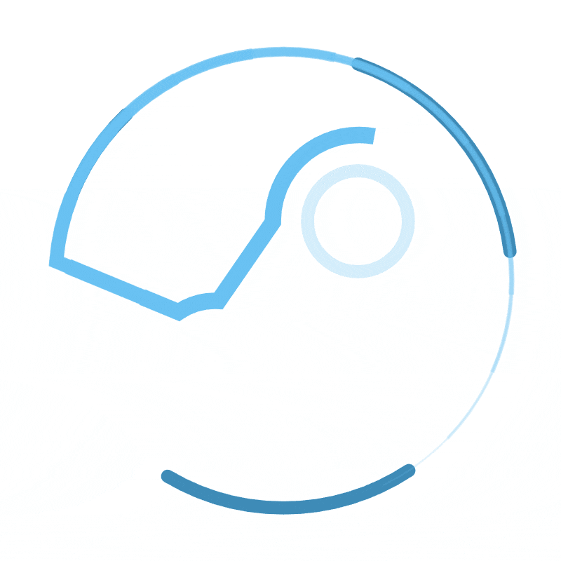

[![Contributors][contributors-shield]][contributors-url]
[![Forks][forks-shield]][forks-url]
[![Stargazers][stars-shield]][stars-url]
[![Issues][issues-shield]][issues-url]
[![Last Commit][last-commit-shield]][commit-url]
[![LinkedIn][linkedin-shield]][linkedin-url]

<!-- PROJECT LOGO -->
 

  

<h3 align="center">My Personal Portfolio Website</h3>

  

    A simple website devoped using Angular V17 and hosted using Netlify.
     
    <a href="https://github.com/Sia-WRWD/my-portfolio-v2/blob/main/README.md"><strong>Explore the docs »</strong></a>
     
     
    <a href="https://www.heysia.dev">View Demo</a>
    ·
    <a href="https://github.com/Sia-WRWD/my-portfolio-v2/issues/new?labels=bug&template=bug-report---.md">Report Bug</a>
    ·
    <a href="https://github.com/Sia-WRWD/my-portfolio-v2/issues/new?labels=enhancement&template=feature-request---.md">Request Feature</a>
  

<!-- TABLE OF CONTENTS -->

  
Table of Contents

  <ol>
    <li>
      <a href="#about-the-project">About The Project</a>
      <ul>
        <li><a href="#built-with">Built With</a></li>
      </ul>
    </li>
    <li>
      <a href="#getting-started">Getting Started</a>
      <ul>
        <li><a href="#prerequisites">Prerequisites</a></li>
        <li><a href="#installation">Installation</a></li>
      </ul>
    </li>
    <li><a href="#usage">Usage</a></li>
    <li><a href="#roadmap">Roadmap</a></li>
    <li><a href="#contributing">Contributing</a></li>
    <li><a href="#license">License</a></li>
    <li><a href="#contact">Contact</a></li>
    <li><a href="#acknowledgments">Acknowledgments</a></li>
  </ol>

<!-- ABOUT THE PROJECT -->
## About The Project

[![Product Name Screen Shot][product-screenshot]](https://www.heysia.dev)

Welcome to the source of my personal portfolio website. This website contains all you need to know about myself, past education, experiences and projects. The UI of the website was inspired by the popular gaming platform, Steam's Profile Page.

(<a href="#readme-top">back to top</a>)

### Built With

* [![Angular][Angular.js]][Angular-url]
* [![SASS][SASS]][SASS-url]
* [![FontAwesome][FontAwesome]][FontAwesome-url]

(<a href="#readme-top">back to top</a>)

<!-- RESOURCES -->
## Resources Used
1. [On-Scroll Reveal Animation with React & Framer Motion](https://youtu.be/2V1WK-3HQNk?si=GUd_iBUAG38Gvc0C)
2. [Mouse Hover Tilt using Vanilla Tilt JS](https://micku7zu.github.io/vanilla-tilt.js/)
3. [Sending Emails from React App with EmailJS | Step-by-Step Tutorial](https://youtu.be/wWiTouBHibs?si=5hgHlVj2ghBfUnB_)
4. [Setup a Custom Domain in Netlify in 5 Minutes](https://www.youtube.com/watch?v=bY7Tkh9Vz8I)
5. [Make React Audio Player with Controls & Waveform](https://www.youtube.com/watch?v=rT6GiYEIdGs)

#### Angular Components
1. [NGX-Carousel-Ease](https://www.npmjs.com/package/ngx-carousel-ease)
2. [NG-In-Viewport](https://www.npmjs.com/package/ng-in-viewport)
3. [GlassMorphism](https://css.glass/)
4. [Scroll-Into-View](https://stackoverflow.com/questions/49820013/javascript-scrollintoview-smooth-scroll-and-offset)
5. [Google Map Contact](https://www.youtube.com/watch?v=nwEB3Wxh5N0&t=955s&ab_channel=CarpoolVenom)

#### Misc Resources
1. [Mobile Responsive Hamburger Icon](https://codepen.io/alvarotrigo/pen/ExwgbZv)
2. [Profile Background](https://steamcommunity.com/id/jcn_loveinapril)
3. [Profile Picture Frame](https://steamcommunity.com/id/jcn_loveinapril)
4. [Vector Logo](https://worldvectorlogo.com/logo/azure-2)
5. [GitHub Shields Logo](https://github.com/Ileriayo/markdown-badges)
6. [CSS Animations](https://codepen.io/nelledejones/pen/gOOPWrK)
7. [Scroll-to-Top During Refresh](https://stackoverflow.com/questions/3664381/force-page-scroll-position-to-top-at-page-refresh-in-html)
8. [Freiren Background](https://www.uhdpaper.com/2023/12/frieren-sousou-no-frieren-anime-4k-6071n.html?m=0#google_vignette)

#### Note for Self on SVG Icon Creation
1. Look for existing SVG (WorldVectorLogo, Github Shields)
2. To enable icon color change based on the css property of color, change the fill in svg path to "currentColor".

<!-- ACKNOWLEDGMENTS -->
## Acknowledgments

This markdown was created with the help of the template provided by user othneildrew:

* [Best-README-Template](https://github.com/othneildrew/Best-README-Template)

<!-- MARKDOWN LINKS & IMAGES -->
<!-- https://www.markdownguide.org/basic-syntax/#reference-style-links -->
[contributors-shield]: https://img.shields.io/github/contributors/Sia-WRWD/my-portfolio-v2.svg?style=for-the-badge
[contributors-url]: https://github.com/Sia-WRWD/my-portfolio-v2/graphs/contributors
[forks-shield]: https://img.shields.io/github/forks/Sia-WRWD/my-portfolio-v2.svg?style=for-the-badge
[forks-url]: https://github.com/Sia-WRWD/my-portfolio-v2/network/members
[stars-shield]: https://img.shields.io/github/stars/Sia-WRWD/my-portfolio-v2.svg?style=for-the-badge
[stars-url]: https://github.com/Sia-WRWD/my-portfolio-v2/stargazers
[issues-shield]: https://img.shields.io/github/issues/Sia-WRWD/my-portfolio-v2.svg?style=for-the-badge
[issues-url]: https://img.shields.io/github/issues/Sia-WRWD/my-portfolio-v2
[license-shield]: https://img.shields.io/github/license/Sia-WRWD/my-portfolio-v2.svg?style=for-the-badge
[license-url]: https://github.com/Sia-WRWD/my-portfolio-v2/blob/master/LICENSE.txt
[last-commit-shield]: https://img.shields.io/github/last-commit/Sia-WRWD/my-portfolio-v2.svg?style=for-the-badge
[commit-url]: https://github.com/ir4un/pt-v01/commits/main/
[linkedin-shield]: https://img.shields.io/badge/-LinkedIn-black.svg?style=for-the-badge&logo=linkedin&colorB=555
[linkedin-url]: https://www.linkedin.com/in/scz2401/
[product-screenshot]: /public/githubthumb.png
[Angular.js]: https://img.shields.io/badge/Angular-20232A?style=for-the-badge&logo=angular&logoColor=61DAFB
[Angular-url]: https://angular.io/
[SASS]: https://img.shields.io/badge/SASS-20232A?style=for-the-badge&logo=sass
[SASS-url]: https://sass-lang.com/
[FontAwesome]: https://img.shields.io/badge/Fontawesome-20232A?style=for-the-badge&logo=fontawesome
[FontAwesome-url]: https://github.com/FortAwesome/angular-fontawesome